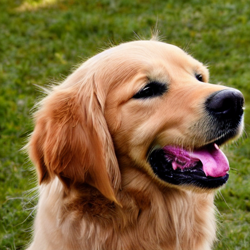
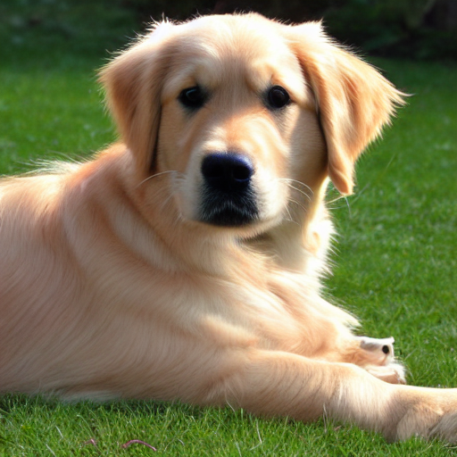
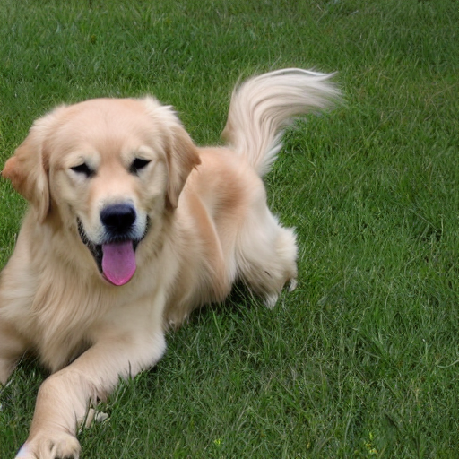
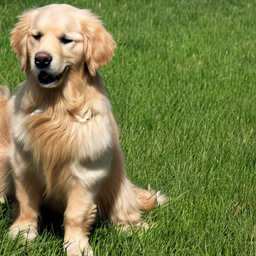

# Dog Image Generation with Diffusion
Using two methods to produce images of dogs through diffusion models. First, using a pretrained model (Stable Diffusion v1.5) and Low-Rank Adaptation to fine-tune to generate images of Golden Retrievers. And second, training a diffusion model from scratch to produce images of dogs.

## Team Members

| Name | Email |
|------|-------|
| **Joseph Schaak** | schaa140@umn.edu | 
| **Ning-Shan Chang** | chan2497@umn.edu | 
| **Wenhui Cheng** | chen9005@umn.edu | 

## Table of Contents

-   [Dependencies](#dependencies)
-   [Installation](#installation)
-   [A-Overview](#A-overview)
-   [A-How to Run](#A-how-to-run)
-   [A-Results](#A-results)
-   [B-Overview](#B-overview)
-   [B-How to Run](#B-how-to-run)
-   [B-Results](#B-results)
-   [References](#references)


## Dependencies

* transformers
* diffusers
* accelerator
* torch
* numpy
* datasets
* huggingface_hub
* peft
* gradio
* safetensors
* os
* torchvision
* PIL
* lpips
* clip
* tqdm


In addition to these packages, Stable Diffusion v1.5 must be installed. SD v1.5 can be found on the following HuggingFace directory: <br>
https://huggingface.co/stable-diffusion-v1-5/stable-diffusion-v1-5/


## Installation

```bash
# Clone repo
git clone https://github.com/lynnc03/cv5561-f25-team-dogdetect
cd cv5561-f25-team-dogdetect

# (optional) Create virtual environment
python3 -m venv .venv
source .venv/bin/activate

# Install required packages
pip install -r requirements.txt
```

# Part A - SD v1.5 and Low Rank Adaptation

## A-Overview

### Objective:
Generate more realistic Golden Retriever images using LoRA (Low-Rank Adaptation) on a pre-existing diffusion model (Stable Diffusion)

### Motivation
Generating lifelike Golden Retriever images not only advances diffusion model research but also highlights how AI-generated animals can bring emotional comfort and support mental health.

### Input/Output
Text prompt → Image of Golden Retriever.

### Method
Use the LoRA fine-tuning on the diffusion model to adapt the model for golden retriever style

## A-How to Run

(Note: Prior to running any LoRA fine-tuning or image generation scripts, first ensure that SD v1.5 is properly installed. Then, `cd path/to/sd-lora`)

### To initiate LoRA fine-tuning:
```bash
python -m accelerate.commands.launch train_text_to_image_lora.py \
  --pretrained_model_name_or_path="</path/to/stable-diffusion-v1-5>" \
  --resolution=512 --center_crop --random_flip \
  --train_batch_size=1 \
  --gradient_accumulation_steps=4 \
  --gradient_checkpointing \
  --mixed_precision="bf16" \
  --max_train_steps=15000 \
  --learning_rate=1e-05 \
  --max_grad_norm=1 \
  --lr_scheduler="constant" --lr_warmup_steps=0 \
  --output_dir="/path/to/tuning/output" \
  --train_data_dir="/path/to/golden_retriever_imgs"
```
(Note: Different hyperparameters will provide varying results)

### To generate images with default SD v1.5:
```bash
python sd-pretrained.py
```
(Note: Directories, hardware optimizations, and input text prompts are defined within the script rather than as parameters. Change these in sd-pretrained.py to match your machine and desired prompts)

### To generate images with LoRA fine-tuned SD v1.5:
```bash
python sd-lora.py
```
(Note: Directories and input text prompts are hardcoded within the script rather than as parameters. Change these in sd-lora.py to match your machine and desired prompts)

### To generate FID, LPIPS, and CLIP scores:
```bash
python evaluater.py
```
(Note: Directories and input text prompts are hardcoded within the script rather than as parameters. Change these in evaluater.py to match your machine)

## A-Results

### Example Results
| Prompt | SD v1.5 |SD + fine-tuning steps=5 | SD + fine-tuning steps=2000 | SD + fine-tuning steps=15000 |
|--------|---------|-------------------------|-----------------------------|-----------------------------|
| "Golden Retriever" |  |  |  |  |

### Evalutation

| Method | FID | LPIPS | CLIP |
|--------|-----|-------|------|
| SD v1.5 |  72.45 | 0.4444 | 0.7529 |
| SD + fine-tuning steps=5 | 74.30 | 0.4371 | 0.7578 |
| SD + fine-tuning steps=2000 | 73.87 | 0.4401 | 0.7612 |
| SD + fine-tuning steps=15000 | 73.64 | 0.4307 | 0.7621 |


# Part B - Built Diffusion Model

## B-Overview

### Objective:
Generate realistic dog images by training a diffusion model from scratch.

### Motivation
Generating lifelike dog images not only advances diffusion model research but also highlights how AI-generated animals can bring emotional comfort and support mental health.

### Input/Output
None → Image of a dog.

### Method
DDPM; U-Net transformer.

## B-How to Run

## B-Results

## References

**deepanway.** (2023). <br>
*text_to_image.*  <br>
Available at: https://huggingface.co/spaces/declare-lab/mustango/blob/293436cffbc0e0e15507bbb031dac78247df681f/diffusers/examples/text_to_image/train_text_to_image_lora.py  <br>
Accessed: 2025-11-18.

**Rombach, R., Blattmann, A., Lorenz, D., Esser, P., & Ommer, B.** (2022).  <br>
*High-Resolution Image Synthesis With Latent Diffusion Models.*  <br>
In Proceedings of the IEEE/CVF Conference on Computer Vision and Pattern Recognition (CVPR), pp. 10684–10695.  <br>
https://arxiv.org/abs/2112.10752


**Stanford Vision Lab.** (2011). <br>
*ImageNet-Dogs Dataset. Stanford University.* <br>
Available at: http://vision.stanford.edu/aditya86/ImageNetDogs/ <br>
Accessed: 2025-11-06.
